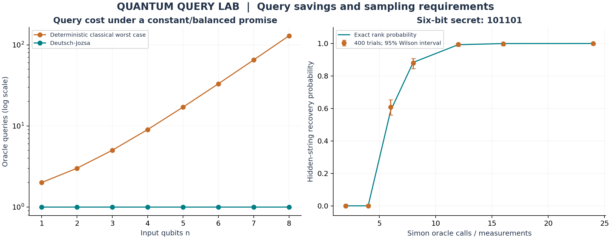

# Quantum Query Lab
### Algorithm comparison · Hidden structure · Sampling requirements

**Question:** When does a quantum algorithm use fewer oracle queries, and what does that comparison actually mean?

This project implements Deutsch-Jozsa classification and Simon's hidden-string algorithm using small, explicit state simulations. It compares promised-problem query costs and tests how many measurements are needed to recover a hidden string.



## Results at a glance

| Experiment | Default result |
| --- | --- |
| Deutsch-Jozsa at n = 8 | One quantum oracle call versus 129 deterministic classical queries in the worst case. |
| Simon at n = 6 | Recovered hidden string `101101` in 99.5% of 400 trials using 12 oracle calls per trial. |
| Mathematical checks | Tests cover every constant/balanced three-bit truth table and all nonzero Simon secrets for n = 2 through 4. |

The comparison is **oracle query complexity**, not elapsed Python time or a claim of practical speedup. Full output: [summary](results/summary.json), [Deutsch-Jozsa data](results/deutsch_jozsa.csv), [Simon data](results/simon_recovery.csv).

## Run it

Python 3.11+, from the repository root:

```bash
python -m venv .venv
source .venv/bin/activate
python -m pip install -r requirements.txt
python -m unittest discover -v
python run.py --seed 2023 --output results
```

Windows activation: `.venv\Scripts\activate`. Runs locally without quantum hardware or credentials.

## Method and assumptions

### Deutsch-Jozsa

The oracle is promised to be either constant or exactly balanced. Apply a Walsh-Hadamard transform, the phase `(-1)^f(x)`, and a second transform. The probability of all-zero output is 1 for a constant oracle and 0 for a balanced oracle. A factored-out target in the minus state supplies phase kickback; n = 1 also covers Deutsch's problem.

The classical baseline reads inputs sequentially, stopping on a disagreement or after `2^(n-1)+1` queries. The displayed tables deliberately realize its worst case. A randomized classical method can reach a chosen confidence with far fewer queries; the plot does not compare against that baseline.

### Simon

Construct the two-to-one oracle `f(x) = min(x, x XOR s)` for a nonzero hidden string s. Each XOR coset has a unique label. Simulate the reversible oracle's action on a uniform input and a zero output register, apply Hadamards to the input, then marginalize the output register.

The resulting samples satisfy `y dot s = 0` over GF(2). Binary row reduction recovers s when the nullspace is one-dimensional. Underdetermined samples return `None`, rather than guessing. The recovery chart compares 400 trials per budget against the exact probability that uniform samples span the (n-1)-dimensional subspace, with 95% Wilson intervals.

## Implementation boundaries

- The simulator knows and constructs each oracle truth table; real oracle construction and data loading are outside the query count.
- Classical input validation is also outside the reported abstract query count.
- Dense arrays have exponential cost; input width is capped at eight qubits.
- Simon's simulator contains the secret to generate samples. The recovery function receives only those samples and their bit width.
- These small synthetic examples do not establish an advantage for ordinary database search or business analytics.

## Repository guide

| File | Purpose |
| --- | --- |
| [algorithms.py](algorithms.py) | Oracle simulation, classification, and GF(2) row reduction. |
| [test_algorithms.py](test_algorithms.py) | Five test methods checking promises, orthogonality, recovery, and invalid inputs. |
| [run.py](run.py) | Cost and recovery experiments. |
| [results](results/) | Reproducible datasets and chart. |

**Extend it:** add a randomized classical Deutsch-Jozsa baseline and compare error probability at a fixed query budget.

## Course connection and provenance

Draws on Lectures 1.2, 2, 4.1, and 4.2: multiple states, circuits, Deutsch/Deutsch-Jozsa/Simon, and computational-cost models. Created in September 2026 based on summer 2023 studies, with AI assistance. See [sources](SOURCES.md), [provenance](PROVENANCE.md), and [license](LICENSE).
